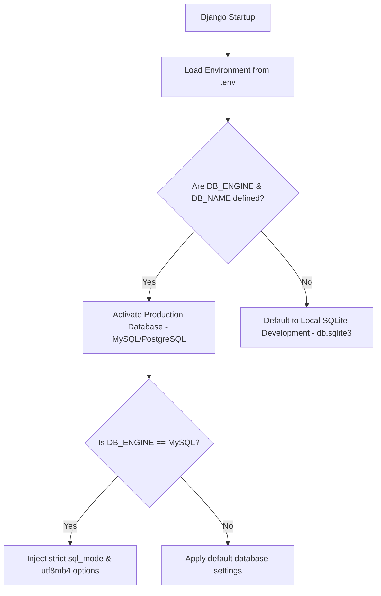

# VorionMart (Markexo) — Live Database Migration & Configuration Guide

To support a scalable, high-throughput production environment, VorionMart's Django backend now includes a **Dynamic Multi-Database Loader**. 

The configuration detects environment settings at runtime. If a live database (e.g. MySQL or PostgreSQL) is defined, the system connects directly to it. Otherwise, it defaults safely to the local SQLite database (`db.sqlite3`), ensuring frictionless transitions between development and production.

---

## 1. How the Dynamic Loader Works

The system checks for a set of specific environment variables via `os.environ` loaded from standard `.env` configuration files.



### Settings Configuration
The database block in [backend/markexo/settings.py](file:///c:/Users/USER/Desktop/markexo/backend/markexo/settings.py) dynamically structures the connections:

```python
# Database configuration - Dynamically choose SQLite or a live production database (MySQL/PostgreSQL) based on environment
DB_ENGINE = os.environ.get('DB_ENGINE', '').strip()
DB_NAME = os.environ.get('DB_NAME', '').strip()

if DB_ENGINE and DB_NAME:
    DATABASES = {
        'default': {
            'ENGINE': DB_ENGINE,
            'NAME': DB_NAME,
            'USER': os.environ.get('DB_USER', '').strip(),
            'PASSWORD': os.environ.get('DB_PASSWORD', '').strip(),
            'HOST': os.environ.get('DB_HOST', 'localhost').strip(),
            'PORT': os.environ.get('DB_PORT', '').strip(),
        }
    }
    # If using MySQL, configure encoding optimizations
    if 'mysql' in DB_ENGINE:
        DATABASES['default']['OPTIONS'] = {
            'charset': 'utf8mb4',
            'init_command': "SET sql_mode='STRICT_TRANS_TABLES'",
        }
else:
    # Fallback to local SQLite development database
    DATABASES = {
        'default': {
            'ENGINE': 'django.db.backends.sqlite3',
            'NAME': BASE_DIR / 'db.sqlite3',
        }
    }
```

---

## 2. Setting Up a Live Production Database (MySQL)

### Step 1: Create a Database
Create a clean database schema on your live MySQL instance:
```sql
CREATE DATABASE vorionmart_db CHARACTER SET utf8mb4 COLLATE utf8mb4_unicode_ci;
```

### Step 2: Configure Environment Variables
Copy [backend/.env.example](file:///c:/Users/USER/Desktop/markexo/backend/.env.example) to a new file named `.env` in the same directory:
```bash
cp backend/.env.example backend/.env
```

Open the newly created `.env` file and set your production coordinates:
```ini
DB_ENGINE=django.db.backends.mysql
DB_NAME=vorionmart_db
DB_USER=your_mysql_username
DB_PASSWORD=your_mysql_secure_password
DB_HOST=your_database_host_ip_or_url
DB_PORT=3306
```

### Step 3: Run Database Migrations
Run Django migrations in your virtual environment to create the required tables in your live database:
```powershell
cd backend
.venv\Scripts\activate
python manage.py migrate
```

---

## 3. Benefits of this Architecture

*   **Frictionless Development:** Developers do not need to install local MySQL/PostgreSQL instances. Running `python manage.py runserver` works immediately out of the box using SQLite.
*   **Security Isolation:** Live production credentials reside exclusively in `.env` (which is excluded from Git tracking via `.gitignore`), keeping production secrets safe.
*   **No Code Changes Required:** Seamless promotion workflows—deploying to production automatically hooks into the live environment without changing `settings.py`.
