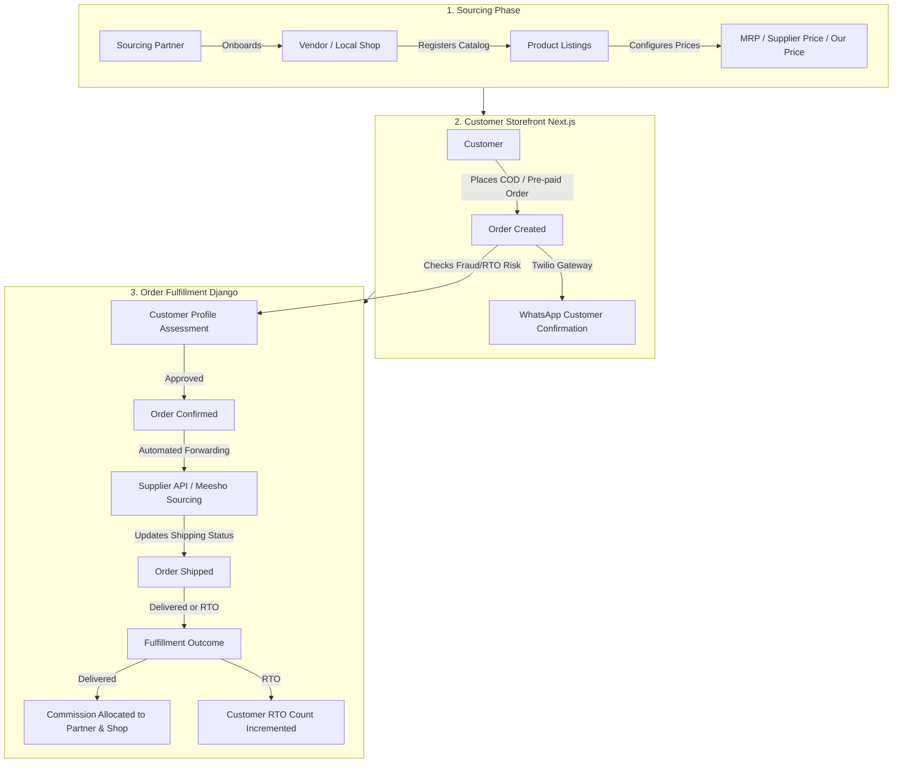
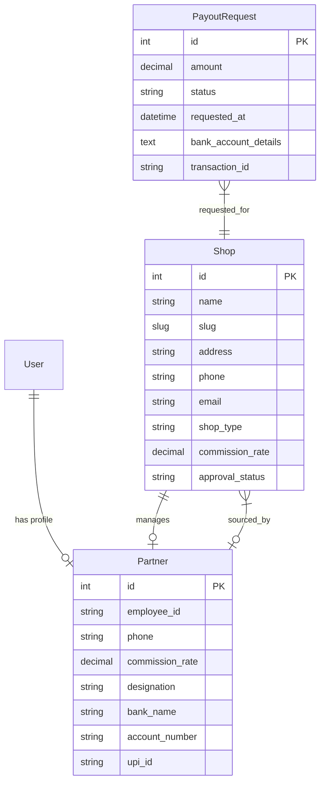
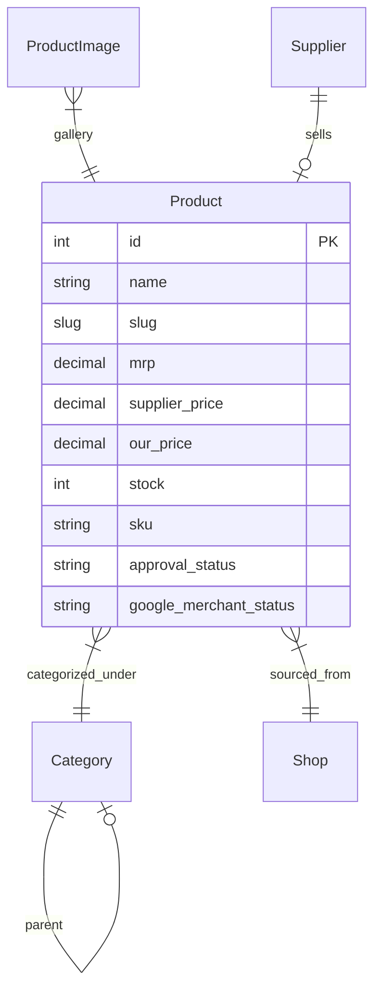
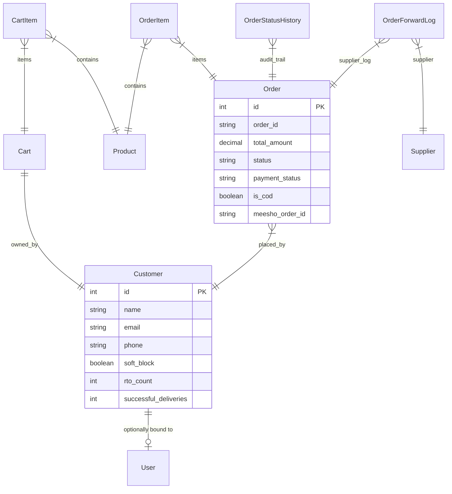

# VorionMart (Markexo) — Comprehensive Project Documentation & Architecture Blueprint

**Project Name:** VorionMart (Codebase: `markexo`)  
**Production URL:** [https://vorionmart.com](https://vorionmart.com)  
**System Version:** `1.0.0`  
**Last Updated:** `2026-06-01`

---

## 1. System Vision & Core Business Architecture

**VorionMart** is a premium, multi-tenant B2C e-commerce marketplace and dropshipping ecosystem specifically engineered for the unique dynamics of the Indian consumer market. By integrating product sourcing partners, third-party merchants, automated supplier routing, and robust fraud prevention, the platform bridges the gap between high-volume suppliers (e.g., Meesho, IndiaMART, and local wholesalers) and retail buyers.



### The Sourcing Partner & Commission Framework
Unlike conventional single-vendor sites, VorionMart uses a **Partner/Employee** workforce. Sourcing partners onboard local merchants or identify highly profitable catalog listings from B2B platforms:
*   **Sourced Shops:** Each merchant is tracked under a `Shop` registry, managed by a `Partner`.
*   **Pricing Split:** Products are configured with an absolute dropshipping structure:
    *   `MRP` (Maximum Retail Price shown to customers)
    *   `Supplier Price` (The wholesale acquisition cost from Meesho/Supplier)
    *   `Our Price` (The retail selling price on the storefront)
    *   `Profit Margin` = `Our Price` - `Supplier Price`
*   **Earnings Allocation:** Upon successful delivery, earnings are dynamically distributed:
    *   A pre-configured percentage of profits goes to the sourced `Shop` (tracked via `commission_rate` on the Shop).
    *   A secondary percentage goes to the `Partner` who managed the cataloging (tracked via `commission_rate` on the Partner profile).
    *   Partners submit **Payout Requests** containing banking/UPI snapshots which administrators review and approve.

### The Cash-on-Delivery (COD) & Return-to-Origin (RTO) Paradox
In the Indian e-commerce landscape, **Cash on Delivery (COD)** represents 70-80% of consumer orders. However, COD carries significant business risk in the form of **RTO (Return to Origin)**—where customers refuse packages at delivery, resulting in double shipping charges for the platform.

VorionMart addresses this with a specialized **RTO Risk Assessment & Fraud Engine**:
*   **Delivery Scorecarding:** Every customer profile automatically tracks `order_count`, `successful_deliveries`, and `rto_count`.
*   **Soft Block System:** If a customer builds a history of repeated delivery refusals, the system triggers a `soft_block` flag, alerting administrators to manually verify or restrict the order during the verification step.
*   **Verification Workflow:** Orders transition through a `pending_verification` phase prior to full warehouse confirmation.

---

## 2. Tech Stack & System Architecture

VorionMart is architected as a decoupled, high-performance web application sharing a unified configuration engine.

```
+----------------------------------------+
|       Next.js 14 Client Storefront      |
|    (React 18, TypeScript, Tailwind)    |
+-------------------+--------------------+
                    | REST APIs / JSON
                    v
+-------------------+--------------------+
|        Django 4.2 Rest Framework       |
|    (Python 3.10+, SQLite/MySQL DB)     |
+-------------------+--------------------+
                    | Integrations
                    +--------------------+-------------------+
                    |                    |                   |
                    v                    v                   v
            [Twilio Webhook]     [Google Content API]  [OpenRouter AI]
               WhatsApp            Merchant Center     Gemini-2.0 Blogs
```

### 1. Front-End Storefront & Administration Portal
*   **Framework:** **Next.js 14** (App Router structure), leveraging React 18 and TypeScript.
*   **Styling:** **Tailwind CSS** with a custom dark-mode-first aesthetic for the admin/partner portals, alongside smooth micro-animations and custom components.
*   **State & Auth:** React Context API (`AuthContext`) managing JWT authorization, route guards, and fine-grained role permissions.
*   **Performance:** Configured with Next.js standalone outputs (`output: "standalone"`) to minimize container sizes in production.

### 2. Back-End Web Service & Database Engine
*   **Framework:** **Django 4.2** & **Django REST Framework (DRF)**.
*   **Database:** Configured with a default relational sqlite engine (`db.sqlite3`) for agile operations, easily portable to production-grade MySQL/PostgreSQL.
*   **Static Asset Delivery:** Served directly in production via **WhiteNoise** with compression and long-term caching headers enabled.
*   **Process Hosting:** Run behind reverse proxies via **Gunicorn** WSGI application servers.

### 3. Shared Configurations (`appConfig.json`)
To avoid hardcoding connection points across the client and API, a shared [appConfig.json](file:///c:/Users/USER/Desktop/markexo/frontend/src/config/appConfig.json) resides in the configuration path, specifying:
*   `serverPort`: Dynamic port configuration for the Django back-end process.
*   `clientPort`: Local port configuration for Next.js hot-reloading.
*   *Both systems read this single config dynamically during startup.*

---

## 3. Database Schema & Data Models

The relational database architecture is defined in [backend/api/models.py](file:///c:/Users/USER/Desktop/markexo/backend/api/models.py). The schema represents an advanced dropshipping and commission-based marketplace:

### Vendor & Organization Registry



#### 1. `Shop`
Stores metadata regarding the supply vendor, warehousing address, and financial shares.
*   **Fields:** `name`, `slug` (unique), `description`, `address`, `city`, `phone`, `email` (unique), `shop_type` (Choices: `b2b_ecommerce`, `local_shop`, `retailer`, etc.), `source_platform` (e.g. Meesho, IndiaMART), `website_url`, `whatsapp_number`, `commission_rate` (default `50.00%`), `approval_status` (Choices: `pending`, `approved`, `rejected`), `sourcing_partner` (FK to Partner).

#### 2. `Partner`
Tracks the internal operations workforce, their bank details for commission payouts, and assigned shops.
*   **Fields:** `user` (OneToOne to Django `User`), `employee_id` (auto-generated e.g. `EMP005`), `phone`, `designation` (default `Product Manager`), `assigned_shop` (FK to Shop), `commission_rate` (default `30.00%`), `bank_name`, `account_number`, `ifsc_code`, `upi_id`, `pan_number`, `is_active`.

#### 3. `PayoutRequest`
Manages the partner's monthly or weekly earnings withdraw requests.
*   **Fields:** `shop` (FK to Shop), `amount`, `status` (Choices: `pending`, `paid`, `rejected`), `requested_at`, `processed_at`, `transaction_id`, `bank_account_details` (Immutable snapshot of the partner's banking coordinates at the moment of request).

---

### E-Commerce Catalog



#### 4. `Category`
Hierarchical tree representing product taxonomy.
*   **Fields:** `name`, `slug` (unique), `description`, `parent` (Self-referential FK enabling nested categories), `image`, `is_active`.

#### 5. `Product`
The central catalog model containing dropshipping markup metrics and search metadata.
*   **Fields:** `name`, `slug`, `description`, `category` (FK to Category), `shop` (FK to Shop), `mrp` (Retail benchmark), `supplier_price` (Meesho wholesale), `our_price` (Front-end list price), `stock`, `sku`, `meesho_url` (Reference sourcing link), `specifications` (JSONField for flexible key-value properties), `is_featured`, `is_active`, `approval_status` (auto-toggles `is_active` on state change), `views` (visit counters), `sold_count` (verified sales), `rating`, `review_count`, `google_merchant_status` (Choices: `pending`, `synced`, `failed`, `not_applicable`).
*   **Derived Properties:**
    *   `current_price`: Customer checkout price (falls back to legacy price columns if `our_price` is missing).
    *   `discount_percent`: Percentage drop calculated from `mrp` to `our_price`.
    *   `profit_margin`: The immediate earnings window (`our_price` - `supplier_price`).
    *   `profit_percent`: Profit yield relative to suppliers.

#### 6. `ProductImage`
Additional carousel graphics supporting catalog pages.
*   **Fields:** `product` (FK to Product), `image`, `is_primary` (determines thumbnail representation).

#### 7. `Supplier`
Directories of API-integrated external fulfillment partners.
*   **Fields:** `name`, `supplier_type`, `source_platform`, `store_url`, `api_endpoint`, `api_key`, `api_secret`, `auto_send` (Automatically forward confirmed orders), `success_rate`.

---

### Customer & Order Cycles



#### 8. `Customer`
Standardizes shopper identity, contact details, and historical RTO tracking metrics.
*   **Fields:** `user` (Optional FK to User), `name`, `email`, `phone`, `address`, `city`, `pincode`, `soft_block` (potential fraud indicator), `order_count`, `successful_deliveries`, `rto_count`.

#### 9. `Cart` & `CartItem`
Database-backed persistence caching users' shopping list selections across devices.
*   **Fields (`Cart`):** `customer` (OneToOne to Customer), `created_at`, `updated_at`.
*   **Fields (`CartItem`):** `cart` (FK to Cart), `product` (FK to Product), `quantity`.

#### 10. `Order`
The primary commerce record driving warehouse workflows.
*   **Fields:** `order_id` (Unique, prefixed with `AGV` followed by 8 random digits), `customer` (FK to Customer), `total_amount`, `status` (Choices: `pending`, `pending_verification`, `confirmed`, `processing`, `ordered_from_meesho`, `shipped`, `delivered`, `completed`, `rto`, `cancelled`, `returned`, `refunded`), `payment_status` (Choices: `pending_cod`, `pending`, `received`, `received_from_meesho`, `failed_rto`, `refunded`), `is_cod` (Boolean determining Cash on Delivery flow), `meesho_order_id`, `refund_status`, `delivery_address`, `delivery_city`, `delivery_pincode`, `cancellation_reason`, `notes`.
*   **Trigger Methods:**
    *   `contributes_to_sales()`: Filter function determining active revenue contributors (excludes `cancelled`, `returned`, `rto`, `refunded`).
    *   `sync_product_sold_counts()`: Post-save hook recalculating the catalog's `sold_count` when orders transition in/out of valid sale states.

#### 11. `OrderStatusHistory`
Maintains an audit ledger capturing order status transitions and operator descriptions.
*   **Fields:** `order` (FK to Order), `status` (current state), `changed_at`, `note`.

#### 12. `OrderItem`
Stores snapshot details of purchased inventory items.
*   **Fields:** `order` (FK to Order), `product` (FK to Product), `shop` (FK to Shop), `product_name`, `quantity`, `price`.

#### 13. `OrderForwardLog`
Tracks attempts to automatically submit confirmed orders to wholesale supplier endpoints.
*   **Fields:** `order` (FK to Order), `supplier` (FK to Supplier), `status` (Choices: `pending`, `sent`, `failed`, `acknowledged`), `request_data` (JSON), `response_data` (JSON), `response_message`, `supplier_order_id`, `retry_count`.

---

### Marketing & Engagement

#### 14. `BlogPost`
Enables the internal generation of SEO articles featuring specific inventory products.
*   **Fields:** `title`, `slug` (unique), `content` (HTML), `excerpt`, `meta_title`, `meta_description`, `keywords` (JSON), `featured_image`, `featured_image_url`, `related_products` (ManyToManyField to Product), `author`, `is_published`, `ai_generated`, `views`.

#### 15. `Review` & `ReviewImage`
Crowdsourced feedback modules automatically authenticating verified purchases.
*   **Fields (`Review`):** `product` (FK to Product), `customer` (FK to Customer), `rating` (1 to 5), `comment`, `verified` (toggles True if customer has order records matching product in `delivered`/`completed` state).
*   **Fields (`ReviewImage`):** `review` (FK to Review), `image`.

#### 16. `Banner`
Sliders featured across the storefront's homepage layout.
*   **Fields:** `title`, `subtitle`, `section` (Choices: `home_hero`, `category_hero`, `promo`), `image`, `link`, `is_active`, `order`.

#### 17. `SiteSetting`
Site-wide variable dashboard.
*   **Fields:** `site_name`, `site_tagline`, `logo`, `contact_email`, `contact_phone`, `address`, `facebook_url`, `instagram_url`, `whatsapp_number`.

#### 18. `ChecklistSection` & `ChecklistItem`
Drives the admin interface's live launch checklists.
*   **Fields (`ChecklistSection`):** `title`, `slug`, `description`, `display_order`.
*   **Fields (`ChecklistItem`):** `section` (FK to ChecklistSection), `title`, `slug`, `priority` (Choices: `Critical`, `High`, `Medium`, `Low`), `status` (Choices: `Not Started`, `In Progress`, `Blocked`, `Completed`), `owner`, `notes`, `is_completed`.

---

## 4. API Catalog & Route Mappings

All REST API endpoints are prefix-routed under `/api/` as defined in [backend/api/urls.py](file:///c:/Users/USER/Desktop/markexo/backend/api/urls.py).

### Storefront APIs (Public & Authenticated Client)
| Endpoint | Method | Purpose | Authentication |
| :--- | :--- | :--- | :--- |
| `/api/categories/` | `GET` | Retrieve list of hierarchical product categories | Public |
| `/api/products/` | `GET` | View active product listing directory (filters: query, pricing) | Public |
| `/api/products/<id>/` | `GET` | View full product specs, images, and reviews | Public |
| `/api/blog/` | `GET` | Access index of published SEO marketing articles | Public |
| `/api/blog/<slug>/` | `GET` | Read specific blog content including related products | Public |
| `/api/banners/` | `GET` | Retrieve active sliding layouts for home promotions | Public |
| `/api/settings/` | `GET` | Retrieve global company settings (address, contacts) | Public |
| `/api/reviews/` | `POST` | Post product review (auto-validates verified purchase status) | Token Auth |
| `/api/cart/` | `GET`/`POST` | Fetch or synchronize client shopping cart database records | Token Auth |
| `/api/orders/create/` | `POST` | Place a standard COD or Pre-paid retail customer order | Public |
| `/api/orders/my-orders/`| `GET` | View order history matching current customer credentials | Token Auth |
| `/api/orders/<id>/` | `GET` | Fetch tracking update records matching `order_id` | Public |
| `/api/orders/<id>/cancel/`| `POST` | Process customer cancellation requests | Public |
| `/api/orders/<id>/return/`| `POST` | Process return claims (valid for 7 days post-delivery) | Public |
| `/api/enquiries/` | `POST` | Submit customer support queries from contact page | Public |
| `/api/auth/register/` | `POST` | Register standard retail client profile | Public |
| `/api/auth/login/` | `POST` | Retrieve active JWT payload tokens | Public |
| `/api/auth/refresh/` | `POST` | Refresh access token expiry credentials | Public |
| `/api/google-merchant-feed/` | `GET` | Outputs live product feeds mapped into Merchant Center XML | Public |

### Partner Portal APIs (Multi-Vendor Management)
Sourcing partners utilize these endpoints to maintain independent vendors and catalogs:
*   `/api/auth/register-partner/` (`POST`): Self-onboard a new partner workspace.
*   `/api/partner/stats/` (`GET`): View personal dashboard metrics (Sourced shops count, total products cataloged, active commissions summary).
*   `/api/partner/shops/` (`GET`): Fetch inventory vendor records managed under partner attribution.
*   `/api/partner/categories/` (`GET`): List available categories for indexing new products.
*   `/api/partner/products/` (`GET`/`POST`): Add or monitor items submitted under the partner's catalog quota.
*   `/api/partner/products/<id>/` (`GET`/`PUT`/`DELETE`): Modify or retire existing catalog listings.

### Operations & Administrator Control APIs
Only system superusers or staff members with delegated permissions can access these routes:
*   `/api/admin/stats/` (`GET`): Primary administrative reporting suite (revenue graphs, RTO ratios, order dispatch summaries).
*   `/api/admin/analytics/` (`GET`): Deep audit analytics mapping catalog visit counts against purchase ratios.
*   `/api/admin/launch-checklist/` (`GET`): Manage the dynamic launch checklists.
*   `/api/admin/launch-checklist/seed/` (`POST`): Autofill standard launcher requirements inside checklist tables.
*   `/api/admin/forward-orders/` (`POST`): Trigger manual or bulk order submission routing to external supplier APIs.
*   `/api/admin/google-merchant/` (`POST`): Sync selected catalog inventories directly with the Google Content API for Shopping.
*   `/api/admin/seo-reports/` (`GET`): Generate site-wide audits scanning for missing header elements or broken policy routes.

---

## 5. Front-End Topology & Pages

The [frontend/src/app](file:///c:/Users/USER/Desktop/markexo/frontend/src/app) directory leverages Next.js 14 App Router specifications.

```
frontend/src/app/
├── layout.tsx                # Base HTML template, theme configuration, providers
├── page.tsx                  # Static entry file importing HomeClient
├── HomeClient.tsx            # Rich storefront home client (hero, promo, product grids)
├── about/                    # Company details & vision
├── contact/                  # Contact form with Enquiry integration
├── login/                    # Customer JWT portal
├── signup/                   # Account registration
├── profile/                  # Order histories & address profiles
├── products/                 # Browse catalog
│   ├── page.tsx              # Dynamic listing filters
│   └── [slug]/               # PDP with reviews, specs, and order CTAs
├── categories/               # List available product taxonomies
├── cart/                     # Cart listing and quantity configuration
├── checkout/                 # Shipping forms & order confirmation
├── track-order/              # Real-time order dispatch updates
├── blog/                     # SEO blog portal index & article reading pages
├── admin/                    # Core Staff & Administration Hub
│   ├── login/                # Staff dashboard login
│   └── page.tsx              # The ultimate operations panel
├── partner/                  # Vendor/Partner workspace
├── robots.ts                 # Search crawler configurations
└── sitemap.ts                # Dynamic sitemap script indexing products & blogs
```

### Key UI Features
*   **HomeClient:** Renders high-quality sliding promotional banners, lists trending category nodes, and serves responsive item cards styled with modern glassmorphism.
*   **Product detail views (`products/[slug]`):** Focuses heavily on customer trust by featuring sticky COD assurances, transparent shipping estimations, dynamic specs, and authentic verified customer reviews.
*   **Admin Dashboard (`admin/page.tsx`):** A beautiful black/dark charcoal workspace built using a comprehensive sidebar layout toggling 19 modular features without page refreshes.

---

## 6. Premium Features & Custom Integrations

### 1. RTO & Fraud Prevention System
Built explicitly to counter COD order losses in India:
1.  During checkout, the system references the customer's phone number against existing database entities.
2.  If the matching profile has an `rto_count` above a preconfigured threshold, or has `soft_block` flagged, the order is tagged as **High Risk**.
3.  Admin controls immediately flag the order within the dashboard. Staff can:
    *   Verify the customer via Twilio WhatsApp prompts.
    *   Cancel the order before it is forwarded to fulfillment.

### 2. Twilio WhatsApp Notification Dispatcher
Located in [backend/api/whatsapp.py](file:///c:/Users/USER/Desktop/markexo/backend/api/whatsapp.py):
*   **Customer Confirmation:** When a transaction is submitted, a WhatsApp payload is dispatched summarizing purchased items, total price, and a link pointing to the tracking route (`/track-order?id=AGV...`).
*   **Operator Alerts:** Administrators receive automated alerts of newly placed orders to ensure rapid confirmation.
*   **Webhook Validation:** Outbound endpoints validate standard `X-Twilio-Signature` signatures to ensure webhook payloads are authentic.

### 3. OpenRouter AI Blog Generation Engine
Located in [backend/api/ai_service.py](file:///c:/Users/USER/Desktop/markexo/backend/api/ai_service.py):
*   **Master Prompt Structure:** Features an advanced prompt system that takes product names, prices, categories, and descriptions, and calls high-end LLMs (defaulting to `google/gemini-2.0-flash-001` or `deepseek/deepseek-chat` via OpenRouter).
*   **Multi-Model Failover:** If the paid API limits are exhausted (HTTP 402/429), it automatically cycles down through a fallback list of free models (e.g., Llama-3.3 70B, Gemma-4 31B, DeepSeek R1).
*   **SEO Automation:** Returns a complete blog package: titles containing product names, optimized URL slugs, meta descriptions under 160 characters, semantic body structures containing product anchors, and 5 dynamic product FAQs.

### 4. Google Merchant Center Content Sync
Located in [backend/api/google_merchant.py](file:///c:/Users/USER/Desktop/markexo/backend/api/google_merchant.py):
*   Synchronizes products directly with the Google Content API for Shopping using service accounts.
*   Maps product catalog elements into the schema needed for Google Free Listings (availabilities, price values, conditions, image URLs, and brand parameters).
*   Serves as a secondary fallback via a dynamic XML route `/api/google-merchant-feed/` for manual Google Content imports.

---

## 7. Operational Playbook & Deployment Guide

### Development Environment Setup

#### Back-End Service Setup
1.  Navigate to directory and activate python virtual workspace:
    ```powershell
    cd backend
    python -m venv .venv
    .venv\Scripts\activate
    ```
2.  Install dependencies:
    ```powershell
    pip install -r requirements.txt
    ```
3.  Execute migrations and spin up back-end server:
    ```powershell
    python manage.py migrate
    python manage.py runserver
    ```

#### Front-End Storefront Setup
1.  Navigate to client directory:
    ```bash
    cd frontend
    ```
2.  Install packages:
    ```bash
    npm install
    ```
3.  Boot dev server:
    ```bash
    npm run dev
    ```

---

### Production Deployment Playbook

#### Back-End Deployment Flow
1.  Ensure variables in [appConfig.json](file:///c:/Users/USER/Desktop/markexo/frontend/src/config/appConfig.json) reflect your production host.
2.  Gather static files:
    ```bash
    python manage.py collectstatic --noinput
    ```
3.  Migrate the schema:
    ```bash
    python manage.py migrate
    ```
4.  Run Gunicorn WSGI container:
    ```bash
    gunicorn markexo.wsgi:application --bind 0.0.0.0:443
    ```

#### Front-End Deployment Flow
1.  Install dependencies and execute compilation commands to output pre-rendered pages:
    ```bash
    npm run build
    ```
2.  Initiate Next.js production server:
    ```bash
    npm run start
    ```

---

## 8. Verification & Launch Checklist

Prior to launching VorionMart to the public, operators should run through the following verification sequence:
*   [ ] **API Environment Sync:** Verify that the frontend can communicate with the backend across the production domain.
*   [ ] **SSL Parity Check:** Audit all static asset URLs to ensure there are no insecure HTTP asset calls.
*   [ ] **Twilio Authentication Test:** Trigger a test checkout order to ensure the WhatsApp confirmation is dispatched.
*   [ ] **RTO Alert Test:** Register a test customer with 3 mock RTO incidents to verify the soft-block indicator flags successfully.
*   [ ] **AI Content Test:** Generate an article using the blog generator to verify the OpenRouter API is communicating.
