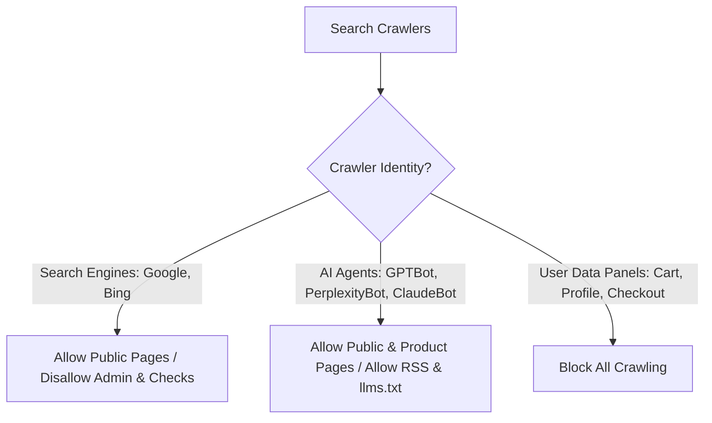

# VorionMart (Markexo) — SEO Engineering & Search Optimization Manual

VorionMart utilizes an enterprise-grade, high-performance search engine optimization (SEO) stack engineered within a **Next.js 14 (App Router) client** and **Django REST Framework (DRF) backend**. 

Rather than relying on basic static templates, the platform employs **programmatic dynamic metadata rendering**, **explicit LLM-search crawl strategies**, **dynamic multi-tier schema injections**, and **automated content generation workflows** to target both traditional engines (Google, Bing) and next-generation AI agents (Perplexity, ChatGPT, Claude).

---

## 1. Traditional & Generative AI Crawling Control

VorionMart's `robots.txt` configuration is uniquely engineered to maximize organic visibility in the era of generative AI search.



### 1.1 robots.ts Implementation
Located in [frontend/src/app/robots.ts](file:///c:/Users/USER/Desktop/markexo/frontend/src/app/robots.ts), the configuration defines explicit rule lists for standard crawlers and LLM search agents:

*   **Public Access Directives:** Unrestricted indexing of public directories (`/`, `/products`, `/categories`, `/blog`).
*   **Transactional Protection:** Administrative portals (`/admin`, `/partner`), checkouts (`/checkout`), user folders (`/profile`, `/cart`), and internal analysis modules (`/seo-dashboard`) are completely blocked.
*   **Targeted AI Agent Optimizations:** Standardizes crawl boundaries for high-intent AI search crawlers:
    *   `GPTBot` & `OAI-SearchBot` (OpenAI / ChatGPT)
    *   `PerplexityBot` (Perplexity AI)
    *   `Google-Extended` (Google Gemini content parser)
    *   `ClaudeBot` & `anthropic-ai` (Anthropic Claude)
    *   `Applebot` (Siri and Spotlight search)

---

## 2. Programmatic Dynamic Metadata & Social Graphing

The platform's metadata architecture is managed at the Next.js layout boundary, using template inheritance to enforce site-wide uniformity:

```typescript
// Shared site layout settings
export const metadata = {
  title: {
    template: '%s | VorionMart',
    default: 'VorionMart - Premium D2C Store | Pay on Delivery',
  },
  description: 'Shop premium products with Cash on Delivery and free 7-day hassle-free returns.',
  keywords: ['ecommerce', 'cash on delivery', 'COD shopping', 'India shopping'],
  alternates: {
    canonical: 'https://vorionmart.com',
  }
}
```

*   **Page-Specific Overrides:** Dynamic routes (e.g. `products/[slug]` or `blog/[slug]`) implement Next.js `generateMetadata()` hooks. These hooks resolve product records or blog objects asynchronously and return context-aware titles, description excerpts (trimmed to ~155 characters for SERP guidelines), and primary keywords.
*   **Social Graphs (OpenGraph & Twitter Cards):** Automatically populates rich card variables:
    *   `og:type` toggles between `website` (general pages) and `article` (blog posts) or `product` (PDP).
    *   `og:image` automatically assigns product gallery thumbnails or blog featured graphics.

---

## 3. Dynamically Assembled Multi-Tier Sitemap System

The dynamic sitemap generator in [frontend/src/app/sitemap.ts](file:///c:/Users/USER/Desktop/markexo/frontend/src/app/sitemap.ts) is mapped to run as a serverless edge function, automatically pulling real-time relational tables during search engine queries.

```
                  [sitemap.xml Query]
                           |
            +--------------+--------------+
            |                             |
     [Static Routes]             [Dynamic Fetching]
     - Homepage (1.0)                     |
     - /products (0.9)            +-------+-------+
     - /categories (0.9)          |               |
     - /blog (0.8)          [Django DB API]  [Indexing priorities]
                            - Approved PDPs  - Featured items: 0.95
                            - Active Shops   - Normal items: 0.90
                            - Blogs          - Blog Posts: 0.80
```

### Key Performance Configurations:
*   **Featured Priority Scaling:** Standard products default to `0.90` crawl priority. Items highlighted by operators as `is_featured` are programmatically set to `0.95` to direct search crawler budget to high-yield inventory.
*   **Deduplication Filters:** Dynamic mappings check and deduplicate absolute URLs prior to outputting XML nodes to prevent indexing penalties.
*   **AI Discovery Feeds:** Promotes RSS feeds, Merchant API XML indices (`google-feed.xml`), and Markdown files (`llms.txt`) directly in the sitemap to speed up ingestion by conversational search platforms.

---

## 4. Rich Snippet Schema Injection (JSON-LD)

To guarantee that product search results appear as premium rich snippets containing star reviews, live prices, and instant stock indicators, VorionMart implements advanced JSON-LD structured schemas.

### 4.1 Product Schema Components (`ProductSchema.tsx`)
Defined in [frontend/src/components/ProductSchema.tsx](file:///c:/Users/USER/Desktop/markexo/frontend/src/components/ProductSchema.tsx), the dynamic renderer injects:
1.  **Product Metadata:** Canonical names, brand tags (`"VorionMart"`), description cleaners (regular expressions stripping out raw HTML content), category nodes, and dynamic SKU/GTIN codes.
2.  **Offer Block (`Offer`):** Live selling prices (`our_price`), valid currency (`"INR"`), item conditions (`"NewCondition"`), and stock status hooks.
3.  **Fulfillment Details (`OfferShippingDetails`):** Specifies handling time, transit range (3-7 business days within India region `"IN"`), and local shipping prices (Free shipping above ₹500, otherwise flat ₹49).
4.  **Merchant Return Policy (`MerchantReturnPolicy`):** Declares a formal 7-day return window, shipping returns by mail, and a free return charge model linking back to `/return-refund-policy`.
5.  **Verified Reviews & Fallback Ratings:**
    *   If real reviews exist, compiles dynamic `Review` blocks and calculates weighted average values for `aggregateRating`.
    *   **GSC Validation Shield:** If a new product has zero ratings, the script automatically triggers a **VorionMart Quality Team** fallback review. This prevents Google Search Console validation errors and warning indicators about missing reviews.

### 4.2 Article & FAQ Schema Mappings
*   **Article Schema:** Blog templates automatically wrap editorial content using standard SEO layouts to show publisher logos, publish times, and author profiles.
*   **FAQ Microdata:** Injects question and answer pairs utilizing `acceptedAnswer` fields to capture search real estate via dynamic Google accordion drops.

---

## 5. Automated AI SEO Content Pipeline

The built-in OpenRouter AI Blog Generation Engine in the Django backend acts as a highly automated link builder and keyword targeting machine.

```
[Target Inventory Product] 
       |
       v
[OpenRouter AI Pipeline] ---> Contextual prompt analyzing name, specs, price.
       |
       v
[Semantic HTML Generation]
  - Target keyword-density optimized layout (1.5% - 2.5%)
  - Structural heading hierarchy: H1 (Main Anchor) -> H2/H3 (Sub-sections)
  - Programmatic Product Backlinks (Contextual anchor texts)
  - 5 Dynamic FAQs + HTML microdata injection
       |
       v
[Dynamic Indexing] -> Instantly crawled & referenced in sitemap.xml
```

### Key AI Content Controls:
*   **Contextual Sitelinks:** The engine generates HTML contents containing optimized anchor texts pointing directly back to target storefront products (e.g. `<a href="/products/nike-air-max">Nike Air Max</a>`).
*   **Keyword Control:** Injects target keyphrases seamlessly within headings, intro snippets, and FAQ tables without triggering search engine keyword stuffing penalties.

---

## 6. Organic Google Merchant Center Sync

To target shoppers searching via the Google Shopping tab, VorionMart maintains a fully integrated XML catalog feed at `/api/google-merchant-feed/` backed by Google Content API synchronization:
*   **Dynamic RSS/Atom Feeds:** Serves real-time XML data including titles, descriptive copy, primary categories, condition states, availability, and prices in proper format.
*   **Merchant Sync Job (`backend/api/google_merchant.py`):** Schedulers push batches directly through the Google Content API using secure service accounts, resolving mismatches before they lead to merchant suspension.
